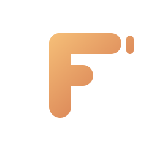

<p align="center">
  
</p>

<h1 align="center">FCC <span style="color:#d97a4a;">Studio</span></h1>

<p align="center">
  A warm-dark, <b>VS Code–like</b> desktop IDE for Claude Code —<br/>
  run the real <code>claude</code> CLI from one app, <i>many conversations at once</i>.
</p>

<p align="center" style="letter-spacing:0.12em;font-size:13px">
  <span style="color:#d97a4a;">◆</span> <b>concurrent chat</b>
  <span style="color:#3b82f6;">◆</span> <b>claude-code parity</b>
  <span style="color:#e6e6e4;">◆</span> <b>warm-dark</b>
</p>

<p align="center">
  
  
  
  
  
  
</p>

<p align="center">
  
  
  
  
</p>

<p align="center">
  <a href="#features">Features</a> ·
  <a href="#quick-start">Quick start</a> ·
  <a href="#shortcuts">Shortcuts</a> ·
  <a href="#docs">Docs</a> ·
  <a href="#license">License</a>
</p>

---

**FCC Studio** is an [Electron](https://www.electronjs.org/) desktop IDE for
[free-claude-code (FCC)](https://github.com/Alishahryar1/free-claude-code). Instead
of juggling a terminal, a browser tab, and a proxy tray app, everything lives in
one window: a file explorer + [Monaco](https://microsoft.github.io/monaco-editor/)
editor, a chat panel that talks to Claude **through the FCC proxy**, an integrated
[xterm](https://xtermjs.org/) terminal, and FCC server health management — a
warm-dark terracotta look, deliberately small, built to feel like a real product.

## Features

### 💬 Multi-conversation chat
- **Run several chats side by side** — each conversation is its own column with its
  own live `claude` subprocess, so you can work two-plus Claude threads in parallel.
- Talks to Claude through the **local FCC proxy**, driving the real `claude` CLI
  over `stream-json` for full Claude Code parity (slash commands, skills, modes).
- **Mode toggle** — `Plan` / `Act` per conversation, plus live effort, fast-mode,
  and thinking controls.
- **Attach images, `@`-mention files**, paste screenshots, re-send an edited turn.
- **Live agent view** — watch subagents, background tasks, and their progress.
- **Activity panel** — every finished turn lands in a sidebar timeline with a file
  influence heat map, ordered tool flow, and read-only snapshot preview + restore.
- **History**: reopen past conversations and continue them (`--resume`) — plus
  your existing **Claude Code CLI sessions** from `~/.claude`, imported and
  resumable in-app.
- **Checkpoints** — rewind your files to before any Claude turn.
- **Compose** — run one prompt across several parallel columns and merge their
  answers (`⊞3` / `Σ Merge`); per-response **Copy / Regenerate**; a **Claude Code
  CLI health** readout (version of the exact binary in use).

### 📁 File explorer + editor
- Open a folder; the tree supports **right-click rename / copy / cut / paste /
  duplicate / delete**, new file/folder inline.
- Multi-tab Monaco editor with syntax highlighting, image preview, undo-aware tabs.
- Find-in-files across the project.

### 🛠 Integrations & panels
- **Terminal** — xterm via node-pty, multiple tabs, dockable right/bottom.
- **Source control** — git status / stage / unstage / diff / commit graph, plus
  **push / pull to GitHub** (first push signs in through Git Credential Manager)
  and a one-click remote connect.
- **Settings** — program + chat settings, an editor for your Claude Code settings
  (incl. **hooks & guardrails**: block Bash commands by pattern via a generated
  PreToolUse hook), an MCP server manager, custom **agents** editor.
- **FCC server** — health in the status bar, one-click start, install detection +
  guided setup modal.
- **Themes** — warm-dark terracotta and a light theme; titlebar, editor, terminal,
  chat and icons all follow (`Ctrl+K Ctrl+T`).
- **What's New** — Help menu opens in-app release notes straight from the bundled
  `CHANGELOG.md`.
- **Auto-update** — Settings → Updates: checks GitHub Releases on launch (or
  manually), downloads and installs on restart. Ready; the feed goes live once
  the release repo exists.

## Quick start

### Install the app (Windows)

1. **Download the installer** — `FCC Studio-<version>-x64.exe`. Double-click and
   walk through the wizard; a desktop shortcut and a Start-menu entry are added.

2. **Install FCC** — on first launch the app checks for it. If it's missing, the
   setup modal gives you the exact install command for your machine (FCC is a
   Python/uv tool, not npm). Once it's there, the app starts the proxy for you.

3. **Start chatting** — open a project folder and ask Claude anything in a chat
   column. Use the panel's **+** button to add a second conversation and run
   several Claude threads side by side.

> ⚠️ Until the app is code-signed, Windows may show a **SmartScreen "Unknown
> publisher"** prompt on first launch — click *More info → Run anyway*.

### Build it yourself (developers)

```bash
npm install
npm run dist:win   # electron-builder NSIS installer → release/
npm run dev        # or run straight from source (HMR)
```

## Shortcuts

| Shortcut          | Action            |
| ----------------- | ----------------- |
| `Ctrl+K Ctrl+T`   | Toggle theme      |
| `Ctrl+B`          | Toggle sidebar    |
| `` `Ctrl+` ``     | Toggle terminal   |
| `` `Ctrl+Shift+` `` | Toggle chat panel |
| `Ctrl+J`          | Toggle terminal   |
| `Ctrl+S`          | Save file         |
| `Shift+Tab` (chat) | Toggle Plan / Act |

## Docs

- [ARCHITECTURE.md](ARCHITECTURE.md) — how it's built + every verified constraint
  (chat subprocess protocol, realtime control, IPC contract, file-system safety).
- [DESIGN.md](DESIGN.md) — the design system (palette, type, layout, motion, theme, a11y).
- [CLAUDE.md](CLAUDE.md) — entry point for Claude Code in this repo.
- [CHANGELOG.md](CHANGELOG.md) — release history (also viewable in-app via Help → What's New).

## License

MIT — see [LICENSE](LICENSE).